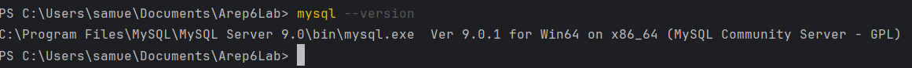
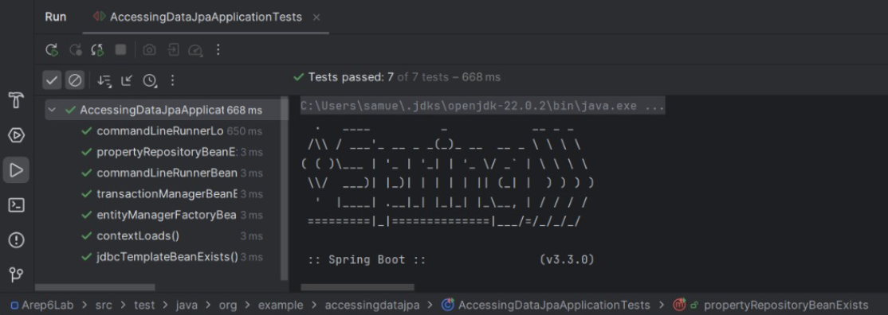
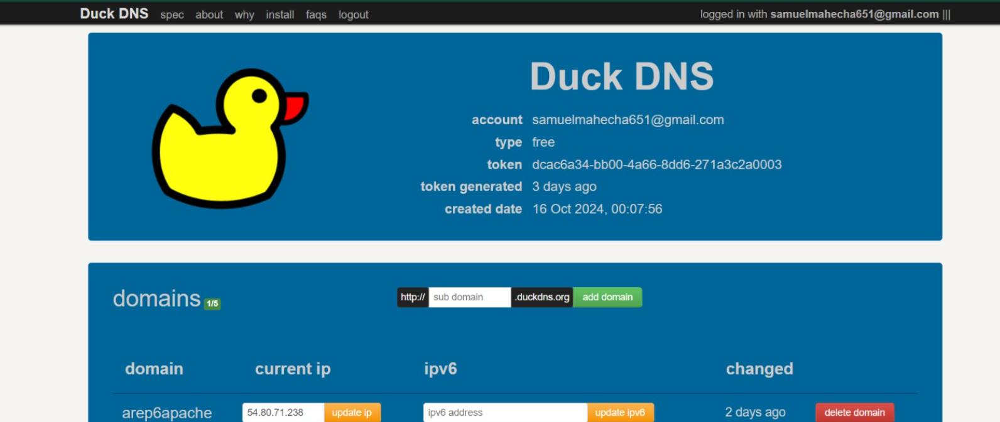
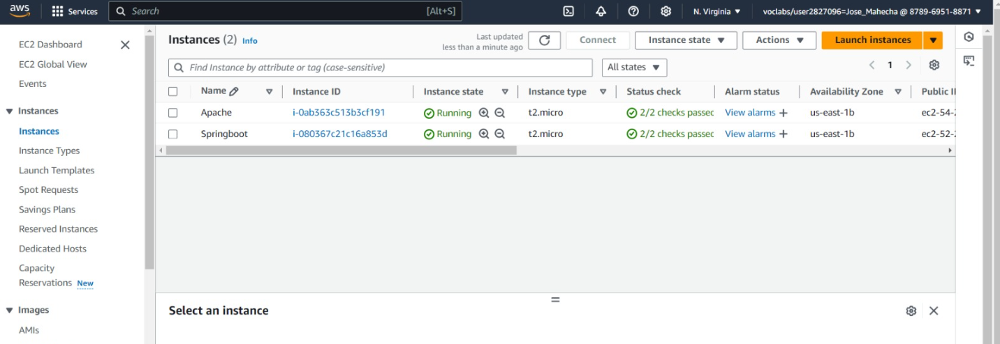
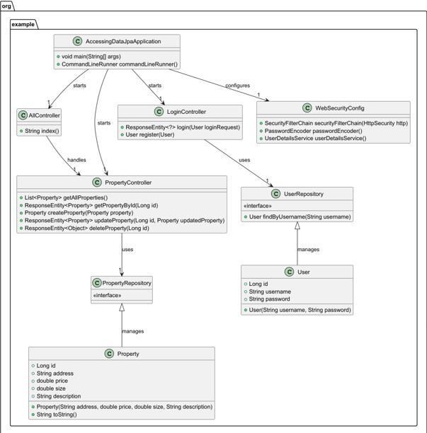
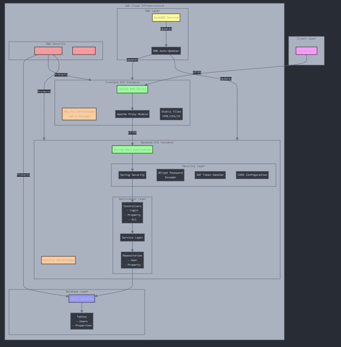

# Secure Application Design
This project is a secure web application architecture deployed on AWS, featuring two core components: a web server running Apache and a backend server using Spring Boot. The application is designed with a focus on security, scalability, and modern development practices, ensuring secure transmission of data between clients and the server using TLS encryption, as well as the secure management of user credentials through password hashing.

## Explanation
The goal of this lab was to build a secure and functional web application using AWS infrastructure, following best practices in security and deployment. The key objectives included:

1. Deploy a two-tier architecture on AWS:

* Use an Apache server for handling frontend requests.
* Use a Spring Boot backend for managing business logic and database operations.

2. Enable secure communication between clients and servers:

* Implement TLS encryption for secure data transmission between the frontend and backend.

3. Implement a login system:

* Ensure secure authentication with password hashing and user management.

4. Create a property management system:

* Allow users to perform CRUD (Create, Read, Update, Delete) operations on property data through a web interface.

5. Store data securely in a MySQL database:

* Ensure the database is securely connected to the backend and store data in a persistent, organized manner.

6. Follow best practices for deploying applications in a cloud environment:

* Leverage AWS EC2 for hosting and maintain a high level of security for sensitive credentials.

## Getting Started

These instructions will get you a copy of the project up and running on your local machine for development and testing purposes. See deployment for notes on how to deploy the project on a live system.

### Prerequisites

Before you begin, ensure that you have the following installed on your local machine:

* Java Development Kit (JDK): Ensure you have JDK 11 or higher installed. You can download it from the Oracle website or use an open-source alternative like AdoptOpenJDK.
```
java -version
```


* Maven: This project uses Maven for dependency management and building the application. Download it from the Maven website and follow the installation instructions.
```
mvn -version
```


* MySQL: Install MySQL Server on your local machine or use a cloud-based MySQL service. You can download MySQL from the MySQL website.
```
mysql --version
```

* 

* Git: You need Git to clone the repository. Download it from the Git website and install it.


to see the maven version we are using we need to enter the following command, also this is the version of Maven this programm uses

### Installing and Running the Application Locally

**Step 1: Clone the Repository**
* First, open a terminal and clone the GitHub repository to your local machine.
```
git clone https://github.com/samuelmahecha/Arep6Lab.git
```

**Step 2: Navigate to the Project Directory**
* Change into the project directory:
```
cd Arep6Lab
```

**Step 3: Set up the MySQL database**
* The project uses MySQL to manage the database, so you'll need to create a local database and configure the connection.
* Open MySQL Workbench or your preferred MySQL client.
* Create a new database with the name "arep6_lab" or any other name you prefer.
```
CREATE DATABASE arep6_lab;
```
* Create a user and grant permissions (if you don’t already have one):
```
CREATE USER 'springuser'@'localhost' IDENTIFIED BY 'the_password';
GRANT ALL ON property_management.* TO 'springuser'@'localhost';
FLUSH PRIVILEGES;
```
* Update the application.properties file with your local MySQL credentials, you should make a file like this:
```
# MySQL configuration
spring.datasource.url=jdbc:mysql://localhost:3306/property_management
spring.datasource.username=springuser
spring.datasource.password=the_password

# Hibernate configuration (optional, you can keep this as is)
spring.jpa.hibernate.ddl-auto=update
spring.jpa.show-sql=true
```
* your_database_name: Replace this with the name of the database you want to connect to. Make sure this database exists in your MySQL server.
* your_mysql_username: Replace this with your MySQL username (default is usually root).
* your_mysql_password: Replace this with your MySQL password.

**Step 4: Install dependencies**
* Now that everything is configured, you need to install the project dependencies. You can do this using Maven.
* Run the following command in your project root folder:
```
mvn clean install

```
* This will download all the necessary dependencies and build the project.

**Step 5: Run the Spring Boot application**
* After installing the dependencies, you can run the Spring Boot application using the following Maven command:
```
mvn spring-boot:run

```
* This will start the application on your local machine. You should see output in the console indicating that the application has started successfully.
* Once the application is running, open your web browser and go to:
 - http://localhost:8080/login.html to access the application’s endpoints.

## Running the tests

To run the automated tests you'll have to type in the console
```
mvn test
```



### Break down into end-to-end tests

1. **Test: contextLoads**

* Purpose: This test ensures that the Spring application context is correctly loaded when the application starts.
* Functionality: It checks that the ApplicationContext object is not null, which means that Spring was able to initialize and load all the necessary beans and configurations without issues.
* Significance: If the application context fails to load, it usually indicates issues with the application's configuration or with the Spring Boot setup. This test ensures that the fundamental setup of your application is correct.

2. **Test: commandLineRunnerLogsMessage**

* Purpose: This test verifies that the CommandLineRunner bean can run its run() method without throwing any exceptions.
* Functionality: It retrieves the CommandLineRunner from the application context and calls its run() method. The test passes if no exceptions are thrown during execution.
* Significance: This is useful for testing that any logic executed during application startup (which typically resides in CommandLineRunner.run()) works correctly and doesn’t cause errors or crashes.

3. **Test: commandLineRunnerBeanExists**

* Purpose: This test checks that a CommandLineRunner bean is properly registered and available in the Spring application context.
* Functionality: It retrieves the CommandLineRunner bean from the ApplicationContext and asserts that it is not null, ensuring that the application has created this bean.
* Significance: The CommandLineRunner interface is often used in Spring Boot applications to run some code at startup. This test ensures that such functionality is available and correctly set up in your application.

4. **Test: propertyRepositoryBeanExists**

* Purpose: This test checks if the PropertyRepository (likely a JpaRepository for managing database entities) bean is available in the Spring context.
* Functionality: It fetches the PropertyRepository bean and ensures that it’s properly created by Spring.
* Significance:validates that the repository bean is not null, confirming its existence in the context. This is crucial for database operations and data access in your application.

5. **Test: entityManagerFactoryBeanExists**

* Purpose: This test verifies that the EntityManagerFactory bean is present in the context. The EntityManagerFactory is responsible for creating and managing EntityManager instances, which are essential for interacting with the database using JPA.
* Functionality: It retrieves the EntityManagerFactory bean from the context and checks that it’s not null.
* Significance: The EntityManagerFactory is a core component for JPA-based database operations. This test ensures that the EntityManagerFactory is correctly set up and available for use in the application.

6. **Test: transactionManagerBeanExists**

* Purpose: This test checks if the TransactionManager bean is present in the Spring context. The TransactionManager is responsible for managing transactions in the application, ensuring that database operations are executed atomically.
* Functionality: It fetches the TransactionManager bean and verifies that it’s not null.
* Significance: The TransactionManager is crucial for maintaining data consistency and integrity in the database. This test confirms that the TransactionManager is properly configured and available for use.

7. **Test:  jdbcTemplateBeanExists**

* Purpose: This test validates the presence of the JdbcTemplate bean in the Spring context. The JdbcTemplate is a simplified JDBC template for database operations, providing a higher-level abstraction for interacting with the database.
* Functionality: It fetches the JdbcTemplate bean and checks that it’s not null.
* Significance: The JdbcTemplate is a useful tool for executing SQL queries and managing database operations. This test ensures that the JdbcTemplate is correctly configured and available for use in the application.

## Deployment

**To deploy the application on AWS, follow these steps:**

**Step 1: Setup DuckDNS Domain for Both Instances**
1. Visit DuckDNS and create a subdomain for your application (e.g., myapp.duckdns.org).
2. Install the DuckDNS client on both EC2 instances to keep their IP addresses updated:
 ```
sudo apt update
sudo apt install curl
```
* Run the following to update the IP automatically:
 ```
curl "https://www.duckdns.org/update?domains=<your-subdomain>&token=<your-token>"

```
* Automate this using a cron job (run crontab -e):
 ```
*/5 * * * * curl "https://www.duckdns.org/update?domains=<your-subdomain>&token=<your-token>"
```
* This will update the IP address every 5 minutes.


**Step 2: Configure Apache EC2 Instance**

1. Install Apache on the EC2 instance:
 ```
sudo apt update
sudo apt install apache2
```
2. Enable Required Apache Modules
* Enable the necessary modules for proxying to the backend:
 ```
sudo a2enmod proxy
sudo a2enmod proxy_http
sudo a2enmod ssl
```
3.  Setup SSL with Let's Encrypt
* Install Certbot to configure SSL for Apache::
 ```
sudo apt install certbot python3-certbot-apache
```
* Request a certificate for your DuckDNS domain:
 ```
sudo certbot --apache -d <your-duckdns-domain>
```
3. Configure Virtual Host for Frontend
* Create a new virtual host configuration file:
```
sudo nano /etc/apache2/sites-available/000-default.conf
```
* Update the configuration to proxy requests to your backend (Spring Boot) and serve the frontend files:
 ```
<VirtualHost *:80>
    ServerName <your-duckdns-domain>
    DocumentRoot /var/www/html

    ProxyPreserveHost On
    ProxyPass /api http://<spring-boot-ec2-ip>:8080/
    ProxyPassReverse /api http://<spring-boot-ec2-ip>:8080/

    ErrorLog ${APACHE_LOG_DIR}/error.log
    CustomLog ${APACHE_LOG_DIR}/access.log combined
</VirtualHost>
```
* Save the file and restart Apache:
 ```    
sudo systemctl restart apache2
```
4. Deploy Frontend Files to Apache
* Copy the frontend files to the Apache document root:
 ```    
sudo cp -r /path/to/frontend/files/* /var/www/html/
```

**Step 3: Setup MySQL on the Backend EC2 Instance"**
1. Install MySQL Server on the backend EC2 instance:
 ```    
sudo apt update
sudo apt install mysql-server
``` 
2. Configure MySQL for Remote Access
* By default, MySQL only allows local connections. You’ll need to modify it to allow remote connections from your Spring Boot application:
* Edit the MySQL configuration file (/etc/mysql/mysql.conf.d/mysqld.cnf) and comment out or change the line bind-address = 127.0.0.1 to 0.0.0.0:
    ```
    sudo nano /etc/mysql/mysql.conf.d/mysqld.cnf
    ```
* Restart MySQL to apply the changes:
    ```
    sudo systemctl restart mysql
    ```
3. Set Up the Database and User
* Create a new database and user for the Spring Boot application:
    ```
    mysql -u root -p
    ```
* Run the following SQL commands to create the database and user:
    ```
    CREATE DATABASE property_management;
    CREATE USER 'springuser'@'%' IDENTIFIED BY 'the_password';
    GRANT ALL PRIVILEGES ON property_management.* TO 'springuser'@'%';
    FLUSH PRIVILEGES;
    ```
* Replace the_password with a secure password of your choice.
* Open port 3306 in the security group of your backend EC2 instance to allow access from your Spring Boot application.

**Step 4: Setup Spring Boot Application on Backend EC2 Instance**

1.  Install Java
* On the backend EC2 instance, ensure Java is installed:
    ```
    sudo apt update
    sudo apt install default-jdk
    ```
2. In your Spring Boot project, update application.properties to connect to the MySQL database:
    ```
    spring.datasource.url=jdbc:mysql://<backend-ec2-ip>:3306/property_management
    spring.datasource.username=springuser
    spring.datasource.password=the_password
    ```
3. Clone the GitHub repository on the backend instance:.
```
git clone https://github.com/samuelmahecha/Arep6Lab.git
cd Arep6Lab
```
* Build the project using Maven:
```
mvn clean install
```
* Run the Spring Boot application:
```
mvn spring-boot:run
```
* To run Spring Boot with TLS (using HTTPS), generate a self-signed certificate or get a signed one from Let's Encrypt, and configure application.properties to use it.
```
server.port=8443
server.ssl.key-store-type=PKCS12
server.ssl.key-store=classpath:keystore.p12
server.ssl.key-store-password=<your-password>
server.ssl.key-alias=<your-alias>

```

* **Step 5: Update Spring Boot for Cross-Origin Requests (CORS)**
* To allow requests from the Apache server (frontend) to the Spring Boot backend, configure CORS in your Spring Boot application:
```
import org.springframework.context.annotation.Bean;
import org.springframework.web.servlet.config.annotation.CorsRegistry;
import org.springframework.web.servlet.config.annotation.WebMvcConfigurer;

@Bean
public WebMvcConfigurer corsConfigurer() {
    return new WebMvcConfigurer() {
        @Override
        public void addCorsMappings(CorsRegistry registry) {
            registry.addMapping("/api/**")
                    .allowedOrigins("https://<your-duckdns-domain>")
                    .allowedMethods("GET", "POST", "PUT", "DELETE");
        }
    };
}
```

**Step 6: Testing the Full Deployment**
1. Test the Frontend:
* Open a browser and visit your DuckDNS domain (https://<your-duckdns-domain>).
* You should see the frontend of your application.
2. Test the Backend:
*Ensure that all API requests from the frontend (served by Apache) are correctly proxied to the Spring Boot backend.
3. Test the Database Connection:
* Verify that the Spring Boot application can connect to the MySQL database on the backend EC2 instance.
4. Verify TLS:
* Ensure that the frontend (Apache) and backend (Spring Boot) communicate over HTTPS using TLS encryption.


### Acceptance test in AWS


https://github.com/user-attachments/assets/2a27888b-e0c2-4256-bc77-d6f3a676789b


### Key Security Features   
1. **TLS Encryption**
* Both the Apache and Spring Boot servers use TLS certificates generated with Let's Encrypt to encrypt communications. This ensures that all data transmitted between the client and server, as well as between the servers themselves, is secure and protected from man-in-the-middle attacks.

2. **Asynchronous Client Communication:**
* The HTML/JavaScript client served by the Apache server uses asynchronous requests to interact with the Spring Boot backend. This architecture improves performance by allowing the frontend to fetch data from the backend without reloading the page while maintaining the security of the requests.

3. **Secure User Authentication:**
* A login system has been implemented using Spring Security. Users authenticate by submitting their username and password to the backend. Passwords are securely stored as hashes using the BCrypt algorithm, ensuring that even in the event of a data breach, raw passwords are not exposed.

4. **MySQL Database:**
* The application stores all property and user data in a MySQL database. The Spring Boot backend connects to this database using secure connection strings, ensuring that all data operations are safely performed.
* Database credentials are securely managed using environment variables and properties files, which are not exposed to version control.

5. **Cross-Origin Resource Sharing (CORS):**
* To prevent unauthorized access to the backend API, CORS is configured to only allow requests from the Apache server hosting the frontend. This restricts access to the API endpoints and prevents cross-site request forgery (CSRF) attacks.

6. **AWS Infrastructure:**
* The entire system is deployed on two separate EC2 instances within AWS:
 - One instance hosts the Apache server, handling client-side code and TLS-secured communication with the client.
 - The second instance hosts the Spring Boot application, which handles backend operations and secures communication with the frontend through RESTful APIs.

7. **Security Groups and Network Configuration:**
* Security groups are configured to restrict access to specific ports and IP addresses, ensuring that only necessary traffic is allowed. For example, the MySQL port is only open to the backend EC2 instance, while the Apache server allows inbound traffic on ports 80 and 443.

8. **Property Management:**
* The core functionality of the application includes the ability to create, read, update, and delete property records. This functionality is exposed through a REST API, allowing for full CRUD (Create, Read, Update, Delete) operations on properties. The API is secured with user authentication to ensure that only authorized users can perform operations on the property data.

### Diagram Class



## Class Diagram Breakdown

### 1. Package: `org.example`
The diagram groups all the classes under the package `org.example`. This helps to organize the code and maintain structure within the application.

### 2. Class: `Property`
**Attributes:**
- `Long id`: The primary key for the Property entity.
- `String address`: The address of the property.
- `double price`: The price of the property.
- `double size`: The size of the property.
- `String description`: A description of the property.

**Constructor:**
- `Property(String address, double price, double size, String description)`: This constructor allows for creating a Property instance with address, price, size, and description.

**Methods:**
- `String toString()`: This method returns a string representation of the property object, useful for debugging or logging.

**Relationships:**
- The `Property` class is managed by the `PropertyRepository` interface (indicated by the arrow `PropertyRepository <|-- Property`).

### 3. Class: `User`
**Attributes:**
- `Long id`: The primary key for the User entity.
- `String username`: The username of the user.
- `String password`: The encrypted password of the user.

**Constructor:**
- `User(String username, String password)`: This constructor is used to create a User instance with the provided username and password.

**Relationships:**
- The `User` class is managed by the `UserRepository` interface (indicated by the arrow `UserRepository <|-- User`).

### 4. Class: `AllController`
**Methods:**
- `String index()`: This method maps the root URL ("/") and serves the `index.html` page from the `src/main/resources/static` directory.

**Relationships:**
- The `AllController` class has no direct relationships with other classes in this diagram but is part of the application’s web controller logic.

### 5. Class: `LoginController`
**Attributes:**
- The `LoginController` uses two fields (`UserRepository` and `PasswordEncoder`), injected via `@Autowired`.

**Methods:**
- `ResponseEntity<?> login(User loginRequest)`: Handles the login request by verifying the provided credentials using the `UserRepository` and `PasswordEncoder`.
- `User register(User user)`: Allows users to register by encoding their passwords and saving the user in the database via `UserRepository`.

**Relationships:**
- `LoginController` interacts with the `UserRepository` to fetch user data and validate login credentials.
- `LoginController` uses the `PasswordEncoder` to hash passwords before saving them to the database.

### 6. Class: `PropertyController`
**Attributes:**
- The `PropertyController` uses a `PropertyRepository` to manage data access for properties.

**Methods:**
- `List<Property> getAllProperties()`: Returns a list of all properties.
- `ResponseEntity<Property> getPropertyById(Long id)`: Fetches a specific property by its ID.
- `Property createProperty(Property property)`: Creates a new property in the system.
- `ResponseEntity<Property> updateProperty(Long id, Property updatedProperty)`: Updates the details of an existing property.
- `ResponseEntity<Object> deleteProperty(Long id)`: Deletes a property by its ID.

**Relationships:**
- `PropertyController` uses `PropertyRepository` to interact with the `Property` entities in the database (indicated by `PropertyController --> PropertyRepository`).

### 7. Interface: `PropertyRepository`
**Type:** `JpaRepository<Property, Long>`
- `PropertyRepository` is a JPA repository interface for managing `Property` entities, providing methods like `findAll`, `findById`, `save`, etc.

**Relationships:**
- It manages the `Property` entity (`PropertyRepository <|-- Property`).

### 8. Interface: `UserRepository`
**Type:** `JpaRepository<User, Long>`
- `UserRepository` is a JPA repository interface for managing `User` entities.

**Methods:**
- `User findByUsername(String username)`: Custom method to find a user by their username.

**Relationships:**
- It manages the `User` entity (`UserRepository <|-- User`).
- It is used by `LoginController` to handle user authentication (`LoginController --> UserRepository`).

### 9. Class: `AccessingDataJpaApplication`
**Methods:**
- `void main(String[] args)`: The entry point for the Spring Boot application.
- `CommandLineRunner commandLineRunner()`: A bean that runs after the application starts and logs a message indicating successful startup.

**Relationships:**
- `AccessingDataJpaApplication` launches other components of the application:
    - `LoginController`, `AllController`, `PropertyController`, and `WebSecurityConfig` are all started by this class (represented by `AccessingDataJpaApplication --> relationships`).

### 10. Class: `WebSecurityConfig`
**Methods:**
- `SecurityFilterChain securityFilterChain(HttpSecurity http)`: Configures security settings, such as permitting access to login endpoints and protecting other resources.
- `PasswordEncoder passwordEncoder()`: Returns a `BCryptPasswordEncoder` bean for hashing passwords.
- `UserDetailsService userDetailsService()`: Configures in-memory users for security testing and defines roles such as `USER` and `ADMIN`.

**Relationships:**
- This class is part of the application's security configuration and is related to Spring Security features.

### Overall Structure and Flow
The diagram focuses on two main areas:

**User authentication and management:**
- This is handled by the `LoginController`, `UserRepository`, and `WebSecurityConfig`. The authentication process involves password hashing and user validation.

**Property management:**
- This is handled by the `PropertyController` and `PropertyRepository`. The system allows CRUD operations on `Property` entities.

**Application Entry Point:**
- The `AccessingDataJpaApplication` is the entry point and starts various components of the system. It connects the web layer (`AllController`, `PropertyController`, `LoginController`) and repository layers (`UserRepository`, `PropertyRepository`).

**Security:**
- The `WebSecurityConfig` class handles the security configuration, setting up role-based access to different parts of the system and managing login functionality.

## Architecture 



## Architectural Components and Flow

### 1. Client Layer

**Web Browser:**
- The entry point for users, accessing the application through HTTPS protocol.
- Communicates with the frontend server using secure TLS/SSL encryption.

### 2. AWS Cloud Infrastructure

**Frontend EC2 Instance**

**Apache Web Server:**
- Serves static content (HTML, CSS, JavaScript).
- Acts as a reverse proxy to the backend.
- Implements SSL/TLS encryption using Let's Encrypt certificates.
- Handles initial user requests and routes them appropriately.

**Backend EC2 Instance (Spring Boot)**
- Consists of several layers:

**Security Layer:**
- Spring Security for authentication and authorization.
- BCrypt password encoding for secure password storage.
- JWT token handling for session management.
- CORS configuration to prevent unauthorized access.

**Application Layer:**

**Controllers:**
- `LoginController`: Handles user authentication.
- `PropertyController`: Manages property CRUD operations.
- `AllController`: General routing and static content.

**Service Layer:**
- Business logic implementation.

**Repository Layer:**
- Data access interfaces.

### 3. Database Layer

**MySQL Database:**
- Stores user credentials and property information.
- Secured through AWS security groups.

**Tables:**
- `Users`: Stores user authentication data.
- `Properties`: Stores property information.

### 4. AWS Security Infrastructure

**Security Groups:**
- Controls inbound/outbound traffic to EC2 instances.
- Restricts database access to backend instance only.
- Manages port access (80, 443, 3306).

**AWS Firewall:**
- Additional layer of network security.
- Protects against common web attacks.

### 5. DNS Layer

**DuckDNS Service:**
- Provides dynamic DNS resolution.
- Automatically updates DNS records.
- Ensures consistent access to the application.

## Security Features

**Transport Layer Security:**
- HTTPS encryption between all components.
- Let's Encrypt certificates for both frontend and backend.
- Secure communication between services.

**Authentication & Authorization:**
- BCrypt password hashing.
- JWT token-based session management.
- Role-based access control.

**Network Security:**
- AWS security groups.
- Firewall rules.
- Port restrictions.
- CORS policies.

## Data Flow

1. User accesses the application through browser.
2. Request is routed to Apache server via HTTPS.
3. Apache server either:
  - Serves static content directly.
  - Proxies requests to Spring Boot backend.
4. Backend processes requests through:
  - Security layer validation.
  - Controller routing.
  - Service layer business logic.
  - Repository layer data access.
5. Data is stored/retrieved from MySQL database.
6. Response follows reverse path back to user.

## Generating javadoc

Simply enter the following commands

```
mvn javadoc:javadoc
```

```
mvn javadoc:jar
```

```
mvn javadoc:aggregate
```

```
mvn javadoc:aggregate-jar
```

```
mvn javadoc:test-javadoc 
```

## Built With

* [Maven](https://maven.apache.org/) - Dependency Management
* [Java](https://www.oracle.com/java/technologies/) - Programming Language
* [HTML 5](https://html.spec.whatwg.org/multipage/) - HiperText Markup Lenguaje
* [Spring](https://spring.io/) - Framework
* [MySql](https://www.mysql.com/)- DataBase
  
## Versioning

Github. 

## Authors

* **Jose Samuel Mahecha Alarcon** -  (https://github.com/samuelmahecha).
